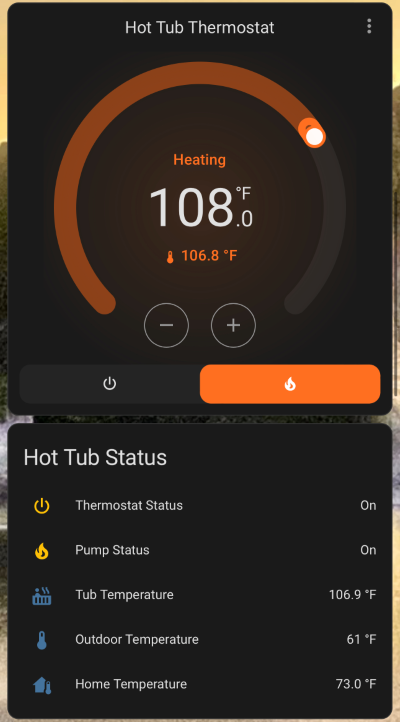

# Hot Tub Recirculation Pump Thermostat

### Hot Tub Thermostat - ESPHome Configuration

This ESPHome project controls a hot tub's temperature using an ESP32-based thermostat. It integrates with Home Assistant, allowing users to monitor and control the thermostat remotely.

#### Key Features:
- **Temperature Control**: Uses a DS18B20 temperature sensor to monitor the tub's temperature.
- **OLED Display**: Shows the current and target temperature in Fahrenheit and the system's mode (heat or off).
- **Physical Buttons**: Three physical buttons allow manual control for:
  - Increasing the temperature
  - Decreasing the temperature
  - Toggling the thermostat between heating and off mode
- **Additional Button**: This optional button controls the outdoor string light which has already been integrated in Home Assistant.
- **Pump Control**: Automatically turns on the pump when heating is active and turns it off when idle.
- **Home Assistant Integration**: View and control the thermostat and pump status via Home Assistant.
- **Web Portal**: Accessible local web server for device monitoring.

#### Hardware:
- **ESP32 Board**
- **DS18B20 Temperature Sensor**
- **SSD1306 OLED Display (128x64)**
- **GPIO-connected physical buttons**
- **Relay for pump control**
- **12V Water Pump & On-demand Propane Water Heater**

### Pin Layout Summary for Hot Tub Thermostat

| **Component**             | **GPIO Pin** | **Description**                           |
|---------------------------|--------------|-------------------------------------------|
| **Temperature Sensor (DS18B20)** | GPIO23       | 1-Wire connection for tub temperature sensor |
| **OLED Display (SSD1306)** | GPIO21 (SDA), GPIO22 (SCL), GPIO17 (Reset) | I2C communication for display |
| **Pump Relay**             | GPIO19       | Controls the pump for heating             |
| **Thermostat On/Off Button** | GPIO26       | Physical button to toggle heat mode       |
| **Increase Temp Button**   | GPIO27       | Physical button to increase target temperature |
| **Decrease Temp Button**   | GPIO14       | Physical button to decrease target temperature |
| **String Light Button**    | GPIO25       | Physical button for controlling the string light |
| **Power Button LED**       | GPIO13       | LED indicator for thermostat power status |
| **Indicator LED**          | GPIO33       | LED indicator for pump status             |

This layout provides connections for the temperature sensor, OLED display, physical buttons, relay, and indicator LEDs. (NOTE: The wiring diagram above shows a slightly different pin layout.) 

#### Dependencies:
- ESPHome installed on your ESP32 device.
- Home Assistant for remote monitoring and control.

For more information on setting up ESPHome and flashing configurations, visit [ESPHome Documentation](https://esphome.io/).

Viewing the temp stats helps you automate the on/off schedule and find the energy consumption.
